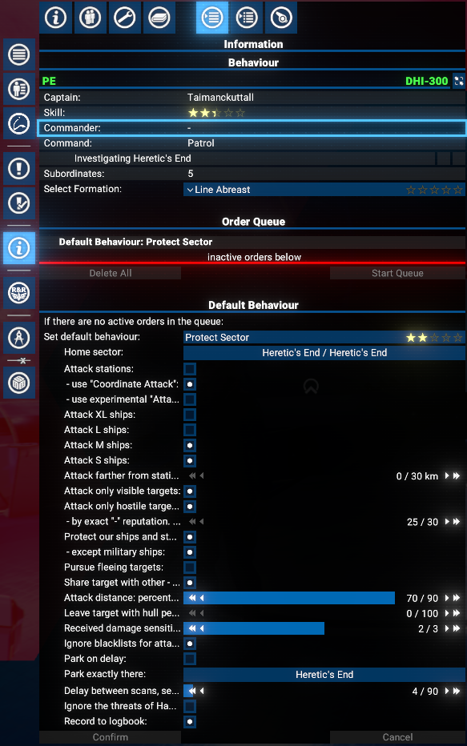
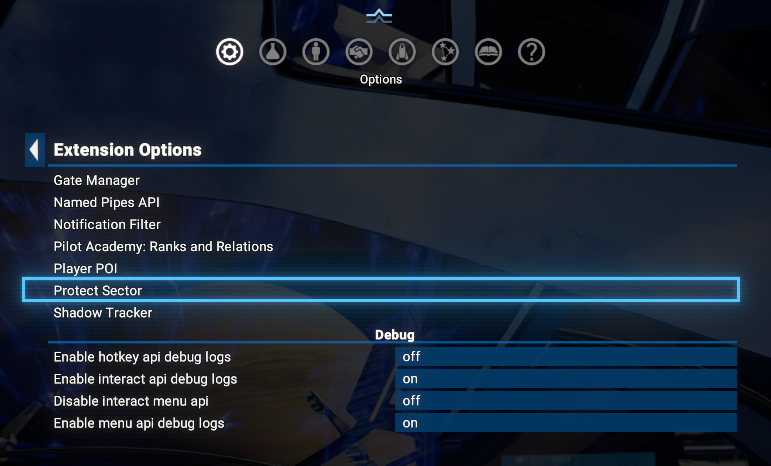
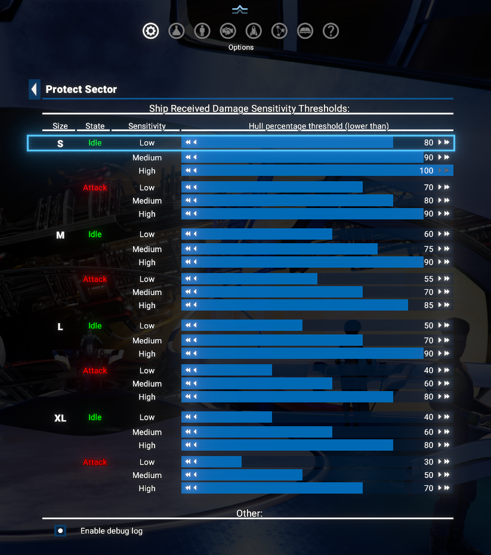

# Protect Sector

This extension allows you to protect a sector from being harassed by hostile ships.
This is useful when you want to prevent hostile ships to attack your ships and stations. Or when you want to prevent from building in a sector.

## Compatibility

Compatible with `X4: Foundations 7.50` and upper.

## Features

- Always the closest possible target will be selected to attack.
- Several ships/fleets with one order can work in one sector or crossed sectors.
- `Mimic` order in a fleet is fully supported. But, again, not set single ship to mimic mode - use the fleet instead.
- The `Lost Ship Replacement` feature is fully supported.
- The own (`Experimental`) order for station attacks is available.
- The workaround for player ships repairing/restocking not only in current sector is implemented based on received damage sensitivity levels.

## Download

You can download the latest version via Steam client - [Protect Sector](https://steamcommunity.com/sharedfiles/filedetails/?id=3379427822)
Or you can do it via the [Nexus Mods](https://www.nexusmods.com/x4foundations/mods/1566)

## Executing the order

You can select the order as any other, like "Protect Station" or "Protect Ship", from the "Combat" section of  orders.
Please be aware - this order requires the ship captain to have at least **two stars** in the "Pilot" skill.

## Configuration

There are a several configuration order parameters available. You can see all of them on a screenshot.

### Home Sector

This is a sector which will be protected. You can select it from the list of discovered sectors.
If you select not current sector, the ship will fly to the selected sector to some "safe" point before to start protecting it.

### Attack Stations

`Disabled` by default.

If enabled, hostile stations in the protected sector will be attacked by ship and fleet.

#### Use "Coordinate attack"

`Enabled` by default.

If enabled, the ship will use the "Coordinate Attack" order to attack the stations. It will be used for the stations only, not for the ships.
If disabled, the ship will use the usual "Attack" order to attack the stations.

#### Use experimental "Attack Station"

`Disabled` by default.
If enabled, the ship will use the Experimental "Attack Station" order to attack the stations. It will be used for the stations only, not for the ships.

Will work only if the ships in a fleet contains only `L` or `XL` classes only. Otherwise it will be de-selected together with "Attack stations" checkbox.

For `L` only - four and more ships are recommended.

#### Common warning for station attacks

In non-OOS mode, i.e. when the Player is in the same sector, the stations drones will attack the ships. The appropriate logic to react on this event is implemented in `Experimental` order, and working not bad :-).
But still not recommended to be in the same sector with the ship, independently of the order type selected.

### Attack Ships

You can select exact ship types:

- XL
- L
- M
- S

By default are none is selected.

If it will find a hostile squad - it will not be attacked, if it contains at least one ship of the type higher than highest selected one.

### Attack farther from stations

There is a slider to define a minimal distance from the possible target to the hostile station. If the distance is less than the defined value, the ship will be selected as a target.
If value is `0` (default one) - the distance will not be checked.

### Attack only visible targets

`Enabled` by default.

Used to prevent the ship from attacking the target, which is not revealed yet or not visible for the player.

It has slightly different behavior for stations and ships:

- For stations - the station should be visible on a map. So - it has to be revealed, but it is not required to be in a live view, i.e. in radar range of your ships, stations, satellites, etc.
- For ships - the ship should be visible online. So - it has to be in a radar range of your ships, stations, satellites, etc.

### Attack only hostile targets

`Enabled` by default.

If enabled, the ship will attack only hostile targets. It will use the appropriate command to filter the targets.

### By negative relation

This is a slider to define the relation to the `Player`. Take in account - relation is shown as `positive` value, due to limitation of the game engine.
So, if you want to attack the ships with relation `-10` and lower - you have to set the value to `10`.
Default value is `25`, i.e. attack the ships with relation `-25` and lower.

Please take in account -  when previous parameter is enabled, you can set this one in between 25 and 30 (-25 and -30 relation).
If the `Attack only hostile targets` is disabled - the value can be set in between 0 and 30 (0 and -30 relation).
**Use it carefully.**

### Protect our ships and stations in sector

`Enabled` by default.

If enabled, the ship will react on the event when the player's ships or stations are attacked in the sector. It will try to protect them by attacking the hostile ships.

### - except military ships

`Enabled` by default.

If enabled, the ship will not protect the military ships. It will not attack the hostile ships, which are attacking the military ships.

### Pursue fleeing targets

`Disabled` by default.

If enabled, the ship will pursue the target, which is trying to flee after is being attacked.

### Share target with other

`Enabled` by default.

If you have more than one ship or squad with the same order, you can disable this option to prevent them from attacking the same target.

### Attack distance: percentage of radar range

This setting allows you to define the ship behavior when the target is identified and selected.
The attack de facto contains two stages:

- The ship is trying to reach the target till some acceptable distance. This distance is defined as a percentage of the radar range.
- The ship is trying to attack the target when it is in the acceptable distance.

### Leave target with hull percentage

It is a percentage of hull of the target to make this order disabled. Useful when you want to achieve more abandoned ships.

By default, it is `0 percent` - i.e. disabled this check.

### Received damage sensitivity

There is three levels: 1 - `Low`, 2 - `Medium`, 3 - `High`. Default value is `2` - `Medium`. Use it to set the sensitivity of the ship to the received damage. The higher value, the more likely the ship will try to move out for repair. Appropriate hull percentage thresholds can be set in the `Extension options` menu.

### Ignore blacklists for attack

`Disabled` by default, but in case of "upgrade" from the previous versions, it will be enabled by default to keep the same behavior as before.
If enabled, the ship will ignore blacklists when going to the `Home sector`. Equal to the behavior of the order before version `1.15`. Otherwise, when not set, the order will use `military` blacklist group to reach the `Home sector`.

### Park on delay

`Disabled` by default.

If enabled, the ship will try to park at position, set by next parameter.

### Park exactly there

It's `optional` parameter, it means - it can be skipped to set. By default it is center of the sector, but you can set it to any position in the sector. It will be used when the `Park on delay` is enabled.

### Delay between scans, seconds

Default value is `4 seconds`.
If you want - you can set it in between 1 and 90 seconds, with step 4 seconds. Bigger value will make less load on the CPU...

### Ignore the threats of Hazardous zones

`Disabled` by default.

Please take in account, some sectors are not safe, even if the ship is not attacked. For example, the sectors with the hazardous zones, like `The Void`. If ship is in the hazardous zone it's shield and then hull will be continuously damaged.
From version 1.15 `Protect Sector` order will raise a fault state for order. Appropriate message will be shown in the logbook.

If you still want to use this order in the hazardous zone - you can enable this option. But please be aware - the ships can be destroyed in the hazardous zone, as there is no good solutions to avoid such zones.

### Record to logbook

`Enabled` by default.

If enabled, the ship will record the events to the logbook. I.e. starts, travel to desired sector, flying to the target, attacking the target, destroying the target, etc.

## Extension options

There are several options available for this order in the `Extension options` menu. Please check the `Protect Sector` section in the `Extension options` menu for more details.

### Ship Received Damage Sensitivity Thresholds

In this section you can set the hull percentage thresholds for the ship to react on the received damage. The ship will try to move out for repair when the hull percentage is less than defined threshold for the current sensitivity level.
The thresholds are defined for three levels of sensitivity: `Low`, `Medium` and `High`. The higher level, the more likely the ship will try to move out for repair.
In addition there is an extra separation by ship sizes and its states - `Idle` or `Attack`. Currently the thresholds for attack state are lower than for idle state, because the ship is more likely to be damaged in attack state. But you can set it as you want.

## Situation when nothing to attack

If no Attack target is selected (i.e. no station and no any ship types are selected) - the ship's captain will periodically call to the player to inform about absence of the order.

## Special Thanks

Special thanks to the pilot [Assailer](https://steamcommunity.com/profiles/76561198087933619/myworkshopfiles/?appid=392160) for his awesome script ["Sector Patrol"](https://steamcommunity.com/sharedfiles/filedetails/?id=2458720435) which was used as a base for this one.

## Links

There is a thread on EgoSoft forum - [[Mod/AIScript] Order "Protect Sector"](https://forum.egosoft.com/viewtopic.php?p=5257237)
