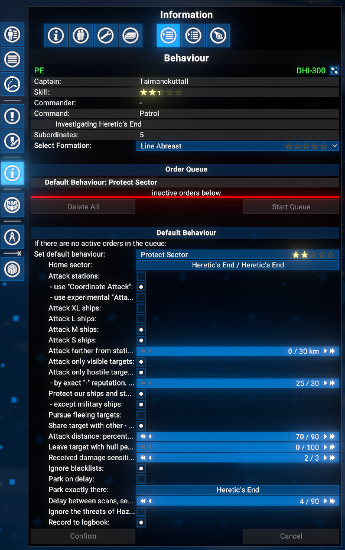
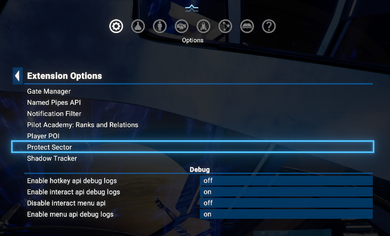
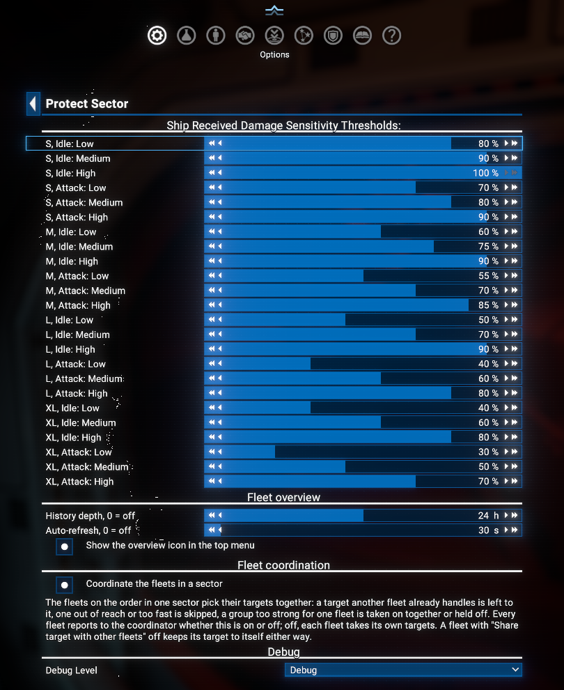

# Protect Sector

This extension allows you to protect a sector from being harassed by hostile ships.
This is useful when you want to prevent hostile ships to attack your ships and stations. Or when you want to prevent from building in a sector.

## Compatibility

Compatible with `X4: Foundations 8.00` and upper. For `7.50` and `7.60` use the version `1.18` of this extension.

## Requirements

- `Mod Support APIs` by [SirNukes](https://next.nexusmods.com/profile/sirnukes?gameId=2659) to be installed and enabled. Version `1.95` and upper is required.
  - It is available via Steam - [SirNukes Mod Support APIs](https://steamcommunity.com/sharedfiles/filedetails/?id=2042901274)
  - Or via the Nexus Mods - [Mod Support APIs](https://www.nexusmods.com/x4foundations/mods/503)
- `Options Helper`, to provide the in-game options page. Version `1.10` and upper is required.
  - It is available via Steam - [Options Helper](https://steamcommunity.com/sharedfiles/filedetails/?id=3715253556)
  - Or via the Nexus Mods - [Options Helper](https://www.nexusmods.com/x4foundations/mods/2089)
- `Print Extension List`, to record the game version and the enabled extensions in the log. Version `1.00` and upper is required.
  - It is available via Steam - [Print Extension List](https://steamcommunity.com/sharedfiles/filedetails/?id=3770927339)
  - Or via the Nexus Mods - [Print Extension List](https://www.nexusmods.com/x4foundations/mods/2191)

## Features

- Always the closest possible target will be selected to attack.
- Several ships/fleets with one order can work in one sector or crossed sectors.
- `Mimic` order in a fleet is fully supported. But, again, not set single ship to mimic mode - use the fleet instead.
- The `Lost Ship Replacement` feature is fully supported.
- The own (`Experimental`) order for station attacks is available.
- The workaround for player ships repairing/restocking not only in current sector is implemented based on received damage sensitivity levels.

## Download

You can download the latest version via Steam client - [Protect Sector](https://steamcommunity.com/sharedfiles/filedetails/?id=3379427822)
Or you can do it via the [Nexus Mods](https://www.nexusmods.com/x4foundations/mods/1566)

## Executing the order

You can select the order as any other, like "Protect Station" or "Protect Ship", from the "Combat" section of  orders.
Please be aware - this order requires the ship captain to have at least **two stars** in the "Pilot" skill.

## Configuration

There are a several configuration order parameters available. You can see all of them on a screenshot.

### Home Sector

This is a sector which will be protected. You can select it from the list of discovered sectors.
If you select not current sector, the ship will fly to the selected sector to some "safe" point before to start protecting it.

### Attack Stations

`Disabled` by default.

If enabled, hostile stations in the protected sector will be attacked by ship and fleet.

#### Use "Coordinate attack"

`Enabled` by default.

If enabled, the ship will use the "Coordinate Attack" order to attack the stations. It will be used for the stations only, not for the ships.
If disabled, the ship will use the usual "Attack" order to attack the stations.

#### Use experimental "Attack Station"

`Disabled` by default.
If enabled, the ship will use the Experimental "Attack Station" order to attack the stations. It will be used for the stations only, not for the ships.

Will work only if the ships in a fleet contains only `L` or `XL` classes only. Otherwise it will be de-selected together with "Attack stations" checkbox.

For `L` only - four and more ships are recommended.

#### Common warning for station attacks

In non-OOS mode, i.e. when the Player is in the same sector, the stations drones will attack the ships. The appropriate logic to react on this event is implemented in `Experimental` order, and working not bad :-).
But still not recommended to be in the same sector with the ship, independently of the order type selected.

### Attack Ships

You can select exact ship types:

- XL
- L
- M
- S

By default are none is selected.

If it will find a hostile squad - it will not be attacked, if it contains at least one ship of the type higher than highest selected one.

### Attack farther from stations

There is a slider to define a minimal distance from the possible target to the hostile station. If the distance is less than the defined value, the ship will be selected as a target.
If value is `0` (default one) - the distance will not be checked.

### Attack only visible targets

`Enabled` by default.

Used to prevent the ship from attacking the target, which is not revealed yet or not visible for the player.

It has slightly different behavior for stations and ships:

- For stations - the station should be visible on a map. So - it has to be revealed, but it is not required to be in a live view, i.e. in radar range of your ships, stations, satellites, etc.
- For ships - the ship should be visible online. So - it has to be in a radar range of your ships, stations, satellites, etc.

### Attack only hostile targets

`Enabled` by default.

If enabled, the ship will attack only hostile targets. It will use the appropriate command to filter the targets.

### By negative relation

This is a slider to define the relation to the `Player`. Take in account - relation is shown as `positive` value, due to limitation of the game engine.
So, if you want to attack the ships with relation `-10` and lower - you have to set the value to `10`.
Default value is `25`, i.e. attack the ships with relation `-25` and lower.

Please take in account -  when previous parameter is enabled, you can set this one in between 25 and 30 (-25 and -30 relation).
If the `Attack only hostile targets` is disabled - the value can be set in between 0 and 30 (0 and -30 relation).
**Use it carefully.**

### Protect our ships and stations in sector

`Enabled` by default.

If enabled, the ship will react on the event when the player's ships or stations are attacked in the sector. It will try to protect them by attacking the hostile ships.

### - except military ships

`Enabled` by default.

If enabled, the ship will not protect the military ships. It will not attack the hostile ships, which are attacking the military ships.

### Pursue fleeing targets

`Disabled` by default.

If enabled, the ship will pursue the target, which is trying to flee after is being attacked.

### Aggressive subordinates

`Disabled` by default.
If enabled, the subordinates will be more aggressive in attacking the targets. It will force them to attack more and more.

### Share target with other fleets

`Enabled` by default.

With it on, this fleet may attack a target together with other fleets running the order in the sector, and they may join it: the coordinator (see `Fleet coordination` below) can send it to a fight another fleet started, call other fleets to its own, or release it together with others against a group none of them could take alone.

With it off, the fleet fights alone and its target is left to it: no other fleet is sent to its target while it is on it, and it is never sent to a target another fleet is already on. This holds whether `Fleet coordination` is on or off.

### Attack distance: percentage of radar range

This setting allows you to define the ship behavior when the target is identified and selected.
The attack de facto contains two stages:

- The ship is trying to reach the target till some acceptable distance. This distance is defined as a percentage of the radar range.
- The ship is trying to attack the target when it is in the acceptable distance.

### Leave target with hull percentage

It is a percentage of hull of the target to make this order disabled. Useful when you want to achieve more abandoned ships.

By default, it is `0 percent` - i.e. disabled this check.

### Received damage sensitivity

There is three levels: 1 - `Low`, 2 - `Medium`, 3 - `High`. Default value is `2` - `Medium`. Use it to set the sensitivity of the ship to the received damage. The higher value, the more likely the ship will try to move out for repair. Appropriate hull percentage thresholds can be set in the `Extension options` menu.

### Ignore blacklists

`Disabled` by default, but in case of "upgrade" from the previous versions, it will be enabled by default to keep the same behavior as before.
If enabled, the ship will ignore blacklists when going to and protecting the `Home sector`. Equal to the behavior of the order before version `1.15`. Otherwise, when not set, the order will use `military` blacklist group to reach and protect the `Home sector`.

### Park on delay

`Disabled` by default.

If enabled, the ship will try to park at position, set by next parameter.

### Park exactly there

It's `optional` parameter, it means - it can be skipped to set. By default it is center of the sector, but you can set it to any position in the sector. It will be used when the `Park on delay` is enabled.

### Delay between scans, seconds

Default value is `4 seconds`.
If you want - you can set it in between 1 and 90 seconds, with step 4 seconds. Bigger value will make less load on the CPU...

### Ignore the threats of Hazardous zones

`Disabled` by default.

Please take in account, some sectors are not safe, even if the ship is not attacked. For example, the sectors with the hazardous zones, like `The Void`. If ship is in the hazardous zone it's shield and then hull will be continuously damaged.
From version 1.15 `Protect Sector` order will raise a fault state for order. Appropriate message will be shown in the logbook.

If you still want to use this order in the hazardous zone - you can enable this option. But please be aware - the ships can be destroyed in the hazardous zone, as there is no good solutions to avoid such zones.

### Record to logbook

`Enabled` by default.

If enabled, the ship will record the events to the logbook. I.e. starts, travel to desired sector, flying to the target, attacking the target, destroying the target, etc.

## Protect Sector common options

These options are on the `Protect Sector` page of the `Extension options` menu.

### Ship Received Damage Sensitivity Thresholds

In this section you can set the hull percentage thresholds for the ship to react on the received damage. The ship will try to move out for repair when the hull percentage is less than defined threshold for the current sensitivity level.
The thresholds are defined for three levels of sensitivity: `Low`, `Medium` and `High`. The higher level, the more likely the ship will try to move out for repair.
In addition there is an extra separation by ship sizes and its states - `Idle` or `Attack`. Currently the thresholds for attack state are lower than for idle state, because the ship is more likely to be damaged in attack state. But you can set it as you want.
Each combination has its own slider, from `10%` to `100%` in steps of `5%`.

### Fleet overview

Two sliders for the `Protect Sector overview` screen, opened from the right-click menu of a ship running the order, or from its own icon in the game's top menu row, right after `Map`.

- `History depth` - how many hours of 15-minute samples are kept for the screen, from `3` to `48`, default `24`. `0` turns the history off and drops what was recorded; the screen then shows the totals since the counters started.
- `Auto-refresh` - how often the open screen fetches fresh numbers, from `30` seconds to `10` minutes in steps of `30` seconds, default `30` seconds. `0` leaves it to the `Refresh` button.

### Fleet coordination

`Enabled` by default.

Every fleet running `Protect Sector` reports to one coordinator: what it is doing, and every target it would like to attack. With the option on, the coordinator decides for the fleets of a sector together. Before a fleet leader attacks a group of enemies, the coordinator weighs the fleet's firepower and that of the fleets already fighting there against the group's:

- a target that fleets nearer to it already handle with enough force is left to them; a fleet farther away than the leader does not count, so the leader attacks a close target itself rather than wait for it;
- a target too far away, or too fast for the leader to catch, is left to the fleet already on it instead of being chased across the sector; a target no fleet is on is still taken;
- a target a nearer idle fleet can take is handed to that fleet;
- a fleet that does not share its target keeps it only while no other fleet is much nearer: the nearer fleet takes it over and the farther one is released;
- a group too strong for one fleet is taken on together: the leader goes and the idle fleets nearby are called in, or, when none can help, the fleets hold off and pledge their strength to the group; they are released together once enough of them have gathered, with one logbook entry and one notification per group per hour;
- a fight that turns against the fleets on it calls for help once and, if none comes within a minute, they break off together;
- when one of your ships or stations is attacked, the coordinator sends the nearest fleet that is strong enough, or two together, instead of waking every idle fleet in the sector; distance and speed only choose between the fleets, so a far or slower fleet still goes when no other can.

With the option off, every fleet takes its own targets as before, and every idle fleet in the sector responds to an attack on your ships. `Share target with other fleets` keeps its meaning in both cases. The option applies at once, on every running order, without a restart.

The coordinator's own settings are on the `Protect Sector overview` screen, `Coordination` tab, at the top of the right side while `All fleets` is selected. Each applies at once; its mouse-over text explains it.

- `Attack responses before a fleet's own targets` - on by default: an attack on one of your ships or stations may take the nearest fleet off a target it picked itself, never off another attack response or a call for help. An idle fleet goes instead unless the busy one is more than 5 km nearer. Applies with coordination on or off.
- `Strength to attack alone` - default `1.5`: the multiple of a hostile group's strength a fleet needs to take it alone. Coordination on only.
- `Strength to attack with help` - default `0.7`: from this multiple a fleet goes in and calls for help; below it, it holds off. Coordination on only.
- `Strength to break off` - default `0.4`: fleets whose fight falls below this multiple call for help, and break off a minute later if still below. Coordination on only.
- `Hostile group radius` - default `10 km`: the enemies of the target's faction within this distance count as its group.
- `Max. distance to a target another fleet has` - default `100 km`: a fleet farther away leaves such a target to the fleet on it.
- `Min. speed against a target another fleet has` - default `90 %` of the target's speed: past the group radius, a slower fleet leaves such a target to the fleet on it.
- `Handoff margin` - default `5 km`: how much nearer a fleet must be to take a target over from another, or for a target to go to an idle fleet instead of the one asking.
- `Timers` - how long the coordinator waits for help before a break-off (`60 s`), keeps a call for help open (`10 min`), ignores further attacks by an attacker it already sent a fleet to (`30 s`), does not offer a declined target again (`5 min`), keeps a refused target out of a fleet's search (`30 s`), between two holding notifications for a target (`60 min`), keeps an unattended target on its board (`60 s`), holds a target for a fleet awaiting its confirmation (`20 s`), resends a break-off (`10 s`), and reuses a measured group or fleet strength (`5 s`, `10 s`).

The three strengths keep their order: `break off` is never above `with help`, which is never above `alone`. `Restore Defaults` under the list puts every one of them back. Each load checks them and puts a missing or invalid value back to its default.

### Debug Level

Sets how much the order writes to the game's debug log:

- `None` - nothing, the default.
- `Debug` - one compact line per state change of the order: target search, target selected, attack started and finished, going idle, re-scan, and similar. Please use this level for a log attached to a problem report.
- `Trace` - in addition, the detailed step-by-step output.

## Situation when nothing to attack

If no Attack target is selected (i.e. no station and no any ship types are selected) - the ship's captain will periodically call to the player to inform about absence of the order.

## Special Thanks

Special thanks to the pilot [Assailer](https://steamcommunity.com/profiles/76561198087933619/myworkshopfiles/?appid=392160) for his awesome script ["Sector Patrol"](https://steamcommunity.com/sharedfiles/filedetails/?id=2458720435) which was used as a base for this one.

## Links

- There is a thread on EgoSoft forum - [[Mod/AIScript] Order "Protect Sector"](https://forum.egosoft.com/viewtopic.php?p=5257237)
- Mod Support APIs:
  - [SirNukes Mod Support APIs on Steam](https://steamcommunity.com/sharedfiles/filedetails/?id=2042901274)
  - [Mod Support APIs on Nexus Mods](https://www.nexusmods.com/x4foundations/mods/503)
- My other mods and tools:
  - [On Steam](https://steamcommunity.com/id/chemodun/myworkshopfiles/?appid=392160)
  - [On Nexus Mods](https://www.nexusmods.com/profile/ChemODun/mods?gameId=2659)
